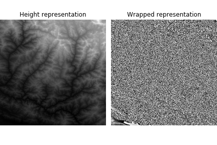

# STRM Lib
STRM Lib is a package to decode data generated from the NASA's Shuttle Radar Topography Mission [STRM](https://www2.jpl.nasa.gov/srtm/).
## STRM Block class
The Block class decodes data from a single file and represents heights contained in a 1 degree tile (~ 111 km depending on latitude). Results for `n27_e085_1arc_v3.bil`, a 1-arc-second accuracy (30 meters) file, rendered in two formats are presented below: Height and Wrapped height.

  

