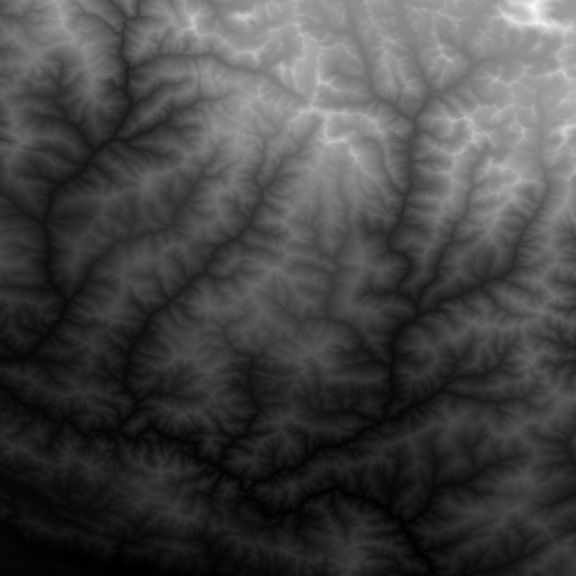

# STRM Lib
STRM Lib is a package to decode data generated from the NASA's Shuttle Radar Topography Mission [STRM](https://www2.jpl.nasa.gov/srtm/).
## STRM Current results
Block class process data from single .bill files. Below a sample of a 1 Arc second file in two versions: Height representation and wrapped.

